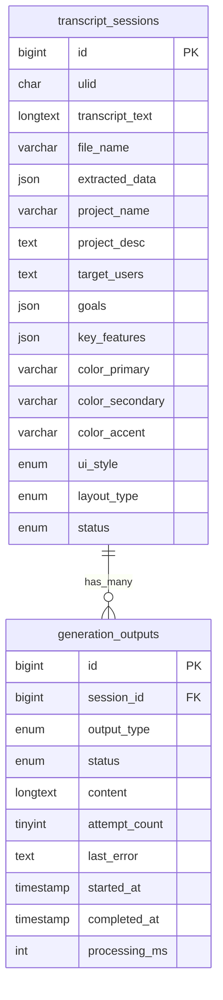
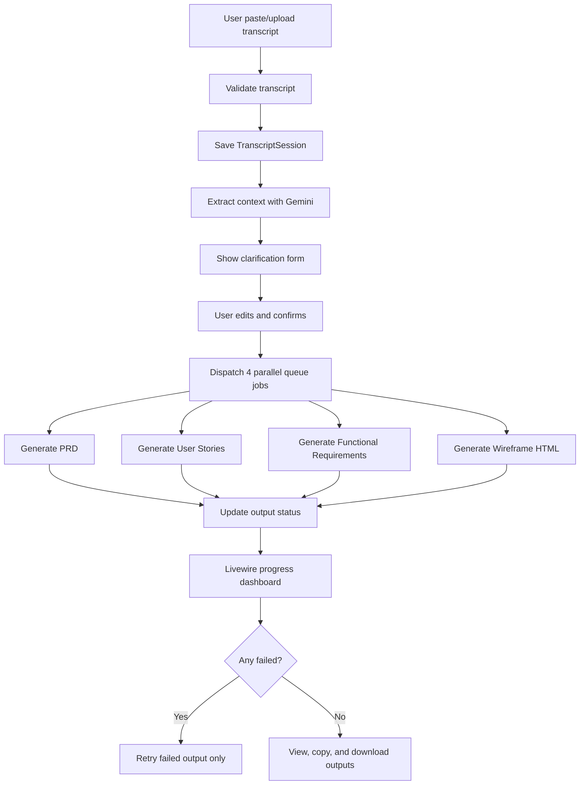

# AI PRD & UI Generator — Product Requirements Document

## AI Context Summary

AI PRD & UI Generator adalah aplikasi web berbasis AI yang mengubah transcript rapat menjadi dokumen produk siap pakai. Sistem menerima input transcript melalui paste text atau upload file, mengekstraksi konteks project menggunakan Google Gemini 2.0 Flash API, meminta user melakukan validasi melalui clarification form, lalu menghasilkan 4 output utama secara paralel melalui Laravel Queue Jobs.

### Core Outputs

1. **Product Requirements Document (PRD)** — dokumen kebutuhan produk lengkap dan profesional.
2. **User Stories** — cerita pengguna Agile dengan acceptance criteria.
3. **Functional Requirements** — daftar kebutuhan fungsional per modul.
4. **UI/UX Wireframe** — halaman HTML siap pakai dengan Tailwind CSS berdasarkan preferensi desain.

### Key Constraints

- Target waktu build: **5 jam**.
- Total output AI: **4 dokumen**.
- User flow utama: **3 step**.
- Harus mendukung **resume/retry** untuk output yang gagal.
- Tidak termasuk autentikasi, kolaborasi real-time, export DOCX/PDF, version history, integrasi Jira/Notion/Linear, dan mobile app.

---

# 1. Executive Summary

AI PRD & UI Generator adalah aplikasi web berbasis kecerdasan buatan yang mengotomatisasi proses transformasi transcript rapat menjadi dokumen produk yang komprehensif dan siap pakai. Aplikasi ini dirancang khusus untuk menjawab tantangan tim produk modern dalam mendokumentasikan hasil diskusi secara cepat, konsisten, dan terstruktur.

Dengan memanfaatkan **Large Language Model (LLM)** melalui **Google Gemini 2.0 Flash API**, sistem mampu menganalisis transcript rapat mentah dan secara otomatis menghasilkan empat jenis output:

- **Product Requirements Document (PRD)** — dokumen kebutuhan produk lengkap dan profesional.
- **User Stories** — cerita pengguna dalam format Agile yang terstruktur dengan acceptance criteria.
- **Functional Requirements** — daftar kebutuhan fungsional yang terorganisir per modul.
- **UI/UX Wireframe** — halaman HTML siap pakai dengan Tailwind CSS berdasarkan preferensi desain.

## Product Snapshot

| Metric | Value |
|---|---:|
| Waktu Build | 5 jam |
| Output Dokumen AI | 4 output |
| User Flow | 3 step |
| Resilience | Resume + Retry Support |

---

# 2. Problem Statement

## 2.1 Latar Belakang

Tim produk dan engineering di perusahaan teknologi menghabiskan rata-rata **30–40% waktu kerja** mereka untuk kegiatan dokumentasi pasca-rapat. Proses manual ini tidak hanya memakan waktu, tetapi juga rentan terhadap inkonsistensi, informasi yang terlewat, dan perbedaan interpretasi antar anggota tim.

## 2.2 Pain Points yang Diidentifikasi

| # | Pain Point | Dampak |
|---:|---|---|
| 1 | Dokumentasi manual memakan waktu lama | Delay sprint planning 1–2 hari setelah setiap rapat besar |
| 2 | Inkonsistensi format dokumen antar tim | Sulit membandingkan PRD lintas project, onboarding lambat |
| 3 | Informasi penting sering terlewat | Rework di fase development karena requirement tidak lengkap |
| 4 | Tidak ada standar user stories | QA dan dev sering salah interpretasi acceptance criteria |
| 5 | Wireframe butuh tools terpisah | Bottleneck di designer, developer tidak bisa mulai estimasi |

## 2.3 Solusi yang Diusulkan

Membangun aplikasi web yang memungkinkan siapa saja — **Product Manager, Tech Lead, atau Founder** — untuk mengunggah transcript rapat dan dalam hitungan menit mendapatkan dokumen produk yang lengkap, terstruktur, dan siap untuk langsung digunakan dalam sprint planning.

---

# 3. Goals & Success Metrics

## 3.1 Primary Goals

| Goal | Target | Ukuran |
|---|---:|---|
| Generate 4 dokumen dari 1 transcript secara otomatis | 100% | Completion rate |
| Waktu generate total < 3 menit per session | < 180 detik | Avg processing time |
| Akurasi ekstraksi data dari transcript | > 85% | User satisfaction score |
| Resumable generation — retry tanpa ulang dari awal | 100% | Failed job recovery rate |
| UI Wireframe HTML langsung dapat digunakan | > 80% | Usability score |

## 3.2 User Personas

### Persona 1: Product Manager

| Attribute | Value |
|---|---|
| Nama | Sarah |
| Umur | 28 tahun |
| Role | Product Manager di startup Series A |
| Goals | Dokumentasi cepat pasca standup; PRD siap sebelum sprint planning |
| Frustrations | Nulis ulang notes jadi dokumen formal; format PRD tidak konsisten antar project |

### Persona 2: Tech Lead

| Attribute | Value |
|---|---|
| Nama | Budi |
| Umur | 32 tahun |
| Role | Tech Lead di agency digital |
| Goals | Functional requirement langsung untuk estimasi; wireframe awal untuk diskusi tim dev |
| Frustrations | Requirement tidak lengkap saat development sudah berjalan; wireframe design lambat dari designer |

---

# 4. Scope

## 4.1 In-Scope

### Fitur yang Termasuk

- Upload transcript (`.txt`, `.pdf`, paste text).
- Auto-extract project context dari transcript.
- Clarification form, pre-filled dan editable.
- Generate PRD dalam Markdown.
- Generate User Stories dalam Markdown.
- Generate Functional Requirements dalam Markdown.
- Generate HTML Wireframe dengan Tailwind CSS.
- Color palette dan UI style picker.
- Resumable generation atau retry per output.
- Real-time progress menggunakan Livewire polling.
- Download output dalam format Markdown dan HTML.

### Fitur yang Tidak Termasuk

- User authentication dan multi-user.
- Kolaborasi real-time antar pengguna.
- Export ke DOCX/PDF.
- Version history dokumen.
- Custom AI model configuration.
- Generate diagram flow/architecture.
- Integrasi Jira, Notion, atau Linear.
- Mobile application.

---

# 5. Feature Requirements

Prioritas:

- **P0** = Critical / must have.
- **P1** = High / should have.
- **P2** = Medium / nice to have.

## F-001 — Transcript Input

| Field | Value |
|---|---|
| Priority | P0 |
| Category | Upload |
| Description | User dapat memasukkan transcript melalui dua cara: paste teks langsung atau upload file (`.txt`/`.pdf`). Sistem melakukan validasi panjang minimum 100 kata dan maksimum 50.000 karakter. |

### Acceptance Criteria

- Input method: textarea untuk paste dan file upload untuk `.txt`/`.pdf`.
- Validasi minimum 100 kata.
- Validasi maksimum 50.000 karakter.
- Feedback error harus jelas.
- File `.pdf` diekstrak teksnya otomatis sebelum diproses.
- Transcript disimpan ke database sebelum proses dimulai.

## F-002 — Auto-Extract Context

| Field | Value |
|---|---|
| Priority | P0 |
| Category | AI Processing |
| Description | Setelah transcript tersimpan, sistem menjalankan satu LLM call ke Gemini untuk mengekstraksi informasi kunci: nama project, deskripsi, target users, goals, key features, serta rekomendasi warna dan style UI. |

### Acceptance Criteria

- Satu Gemini API call dengan output JSON terstruktur.
- Ekstraksi wajib mencakup `project_name`, `project_desc`, `target_users`, `goals[]`, dan `key_features[]`.
- Rekomendasi wajib mencakup `color_palette`, `ui_style`, dan `layout_type`.
- Waktu ekstraksi < 15 detik.
- Jika gagal, tampilkan opsi retry.

## F-003 — Clarification Form

| Field | Value |
|---|---|
| Priority | P0 |
| Category | User Input |
| Description | Form interaktif yang menampilkan hasil auto-extract sebagai nilai default. User dapat mengedit semua field sebelum proses generate dimulai, termasuk memilih color palette dan preferensi desain. |

### Acceptance Criteria

- Semua field pre-filled dari hasil ekstraksi.
- Field wajib tersedia: `project_name`, `project_desc`, `target_users`, `goals`, dan `key_features`.
- `goals` dan `key_features` harus berupa editable list.
- Color picker menyediakan `primary`, `secondary`, dan `accent` dengan preset palette.
- UI style selector menyediakan opsi `minimal`, `modern`, `corporate`, dan `playful`.
- Layout selector menyediakan opsi `dashboard`, `landing`, dan `mobile-first`.
- Validasi: `project_name` wajib diisi sebelum submit.

## F-004 — Parallel Generation Engine

| Field | Value |
|---|---|
| Priority | P0 |
| Category | AI Processing |
| Description | Setelah user konfirmasi clarification form, sistem mendispatch 4 Laravel Queue Jobs secara paralel. Setiap job bertanggung jawab menghasilkan satu jenis output melalui Gemini API. |

### Acceptance Criteria

- Dispatch 4 jobs bersamaan, bukan sequential.
- Setiap job: `GeneratePrd`, `GenerateUserStories`, `GenerateFunctionalReqs`, dan `GenerateWireframe`.
- Job memiliki timeout 120 detik.
- Job memiliki maksimum 3 retry attempts.
- Backoff antar retry: 10s, 30s, 60s.
- Status per output: `pending` → `processing` → `completed`/`failed`.

## F-005 — Resumable Generation

| Field | Value |
|---|---|
| Priority | P0 |
| Category | Resilience |
| Description | Setiap job memeriksa status output sebelum eksekusi. Jika output sudah completed, job langsung skip. Jika failed setelah max retry, user dapat trigger retry secara manual tanpa mengulang output yang sudah berhasil. |

### Acceptance Criteria

- Resume check dilakukan di awal setiap job: jika `status === completed`, job harus skip.
- Track `attempt_count` per output dengan maksimum 3 attempt.
- Tombol **Retry Failed** muncul jika ada output berstatus `failed`.
- Retry hanya untuk output yang failed, bukan semua output.
- Session status: `generating` → `completed`/`partial`/`failed`.

## F-006 — Real-time Progress Dashboard

| Field | Value |
|---|---|
| Priority | P1 |
| Category | UI/UX |
| Description | Halaman dashboard dengan Livewire polling setiap 2 detik untuk menampilkan status generate secara real-time. Setiap output memiliki progress indicator dan tab yang muncul saat output selesai. |

### Acceptance Criteria

- Livewire polling interval: 2 detik.
- Status indicator per output:
  - `pending`: gray.
  - `processing`: blue animate.
  - `completed`: green.
  - `failed`: red.
- Tab output muncul dan aktif saat status `completed`.
- Tampilkan durasi proses tiap output, contoh: `Completed in 8.2s`.
- Auto-stop polling saat semua output `completed` atau `partial`.

## F-007 — Output Viewer

| Field | Value |
|---|---|
| Priority | P1 |
| Category | UI/UX |
| Description | Tampilan hasil untuk masing-masing output. PRD, User Stories, dan Functional Requirements di-render sebagai Markdown. Wireframe ditampilkan dalam iframe preview HTML. |

### Acceptance Criteria

- Markdown rendering untuk PRD, User Stories, dan Functional Requirements.
- Syntax highlighting untuk code blocks dalam Markdown.
- Wireframe preview menggunakan iframe dengan HTML output langsung.
- Tombol download `.md` untuk dokumen.
- Tombol download `.html` untuk wireframe.
- Copy to clipboard per output.

## F-008 — Color Palette & UI Customization

| Field | Value |
|---|---|
| Priority | P1 |
| Category | Design |
| Description | User dapat memilih color palette dan preferensi desain sebelum generate. Pilihan ini digunakan oleh GenerateWireframe job untuk menghasilkan HTML dengan warna dan style yang sesuai. |

### Acceptance Criteria

- Tersedia 5 preset color palette:
  - Modern Blue.
  - Royal Purple.
  - Forest Green.
  - Warm Orange.
  - Dark Pro.
- Custom color picker untuk `primary`, `secondary`, dan `accent`.
- Preview warna secara real-time di form.
- UI style mempengaruhi tone dan komponen wireframe yang digunakan.
- Layout type mempengaruhi struktur halaman wireframe.

---

# 6. Technical Architecture

## 6.1 Technology Stack

| Layer | Teknologi | Alasan |
|---|---|---|
| Backend Framework | Laravel 12 | Familiar stack, produktivitas tinggi, ekosistem lengkap |
| Frontend/Realtime | Livewire 3 | Reactive UI tanpa SPA overhead, polling built-in |
| CSS Framework | Tailwind CSS 3 | Utility-first, konsisten dengan output wireframe |
| Database | MySQL / MariaDB | Relational, ACID compliant untuk session dan output tracking |
| Queue Driver | Database Laravel Queue | Zero dependency tambahan, cukup untuk skala coding test |
| AI Provider | Google Gemini 2.0 Flash | Free tier 1500 req/day, context window 1M token, cepat |
| HTTP Client | Laravel HTTP Client | Built-in, wrapper Guzzle, clean API untuk Gemini calls |
| PDF Parsing | `smalot/pdfparser` | Extract teks dari PDF upload, Laravel package |
| Deployment | VPS + Nginx + PHP-FPM | Full control, queue worker via Supervisor |

## 6.2 Database Schema

### Table: `transcript_sessions`

| Column | Type | Nullable | Description |
|---|---|---|---|
| `id` | BIGINT PK | No | Auto increment primary key |
| `ulid` | CHAR(26) | No | Public unique identifier untuk URL |
| `transcript_text` | LONGTEXT | No | Isi transcript mentah |
| `file_name` | VARCHAR(255) | Yes | Nama file jika upload |
| `extracted_data` | JSON | Yes | Raw hasil auto-extract AI |
| `project_name` | VARCHAR(255) | Yes | Dari clarification form |
| `project_desc` | TEXT | Yes | Deskripsi project |
| `target_users` | TEXT | Yes | Target pengguna |
| `goals` | JSON | Yes | Array string tujuan project |
| `key_features` | JSON | Yes | Array string fitur utama |
| `color_primary` | VARCHAR(7) | Yes | Hex code warna primary |
| `color_secondary` | VARCHAR(7) | Yes | Hex code warna secondary |
| `color_accent` | VARCHAR(7) | Yes | Hex code warna accent |
| `ui_style` | ENUM | No | `minimal`/`modern`/`corporate`/`playful` |
| `layout_type` | ENUM | No | `dashboard`/`landing`/`mobile-first` |
| `status` | ENUM | No | `uploaded`/`extracting`/`clarifying`/`generating`/`partial`/`completed`/`failed` |

### Table: `generation_outputs`

| Column | Type | Nullable | Description |
|---|---|---|---|
| `id` | BIGINT PK | No | Auto increment primary key |
| `session_id` | BIGINT FK | No | FK ke `transcript_sessions` |
| `output_type` | ENUM | No | `prd`/`user_stories`/`functional_requirements`/`wireframe` |
| `status` | ENUM | No | `pending`/`processing`/`completed`/`failed` |
| `content` | LONGTEXT | Yes | Hasil generate dalam Markdown atau HTML |
| `attempt_count` | TINYINT | No | Jumlah percobaan, maksimum 3, default 0 |
| `last_error` | TEXT | Yes | Pesan error terakhir untuk debugging |
| `started_at` | TIMESTAMP | Yes | Kapan job mulai dieksekusi |
| `completed_at` | TIMESTAMP | Yes | Kapan job selesai |
| `processing_ms` | INT UNSIGNED | Yes | Durasi proses dalam milliseconds |

---

# 7. User Stories

| ID | User Story | Benefit | Priority | SP | Done |
|---|---|---|---|---:|:---:|
| US-001 | As a Product Manager, I want to upload atau paste transcript rapat | So that sistem dapat memproses dan mengekstraksi informasi yang relevan | High | 3 | ☐ |
| US-002 | As a Sistem, I want to secara otomatis mengekstraksi data kunci dari transcript | So that user tidak perlu mengisi form dari nol | High | 5 | ☐ |
| US-003 | As a Product Manager, I want to mengedit dan memvalidasi hasil ekstraksi AI sebelum generate | So that output yang dihasilkan sesuai dengan kebutuhan sebenarnya | High | 3 | ☐ |
| US-004 | As a Product Manager, I want to memilih skema warna dan style UI sebelum generate wireframe | So that wireframe yang dihasilkan langsung sesuai dengan branding project | Medium | 2 | ☐ |
| US-005 | As a Sistem, I want to memproses keempat dokumen secara bersamaan di background | So that user mendapat semua output dalam waktu yang lebih singkat | High | 8 | ☐ |
| US-006 | As a Product Manager, I want to melihat status generate setiap dokumen secara real-time | So that mengetahui dokumen mana yang sudah selesai tanpa harus refresh | High | 5 | ☐ |
| US-007 | As a Product Manager, I want to men-trigger ulang hanya output yang gagal tanpa mengulang yang sudah berhasil | So that tidak membuang waktu dan API token untuk output yang sudah completed | High | 5 | ☐ |
| US-008 | As a Product Manager, I want to melihat preview langsung wireframe HTML dalam browser | So that dapat langsung mengevaluasi desain tanpa membuka aplikasi lain | Medium | 3 | ☐ |
| US-009 | As a Product Manager, I want to mengunduh setiap output sebagai file `.md` atau `.html` | So that dapat langsung menggunakan dokumen di tools lain seperti Notion atau GitHub | Medium | 2 | ☐ |

**Total Story Points:** 36 SP

---

# 8. Non-Functional Requirements

| ID | Kategori | Requirement | Target |
|---|---|---|---|
| NFR-01 | Performance | Auto-extract response time | < 15 detik |
| NFR-02 | Performance | Total 4 output generation time | < 3 menit |
| NFR-03 | Performance | Page load time initial | < 2 detik |
| NFR-04 | Reliability | Job retry on failure | Max 3x dengan backoff |
| NFR-05 | Reliability | Session persistence | Data tidak hilang jika browser ditutup |
| NFR-06 | Usability | Mobile responsive | Berjalan di layar >= 375px |
| NFR-07 | Usability | Error feedback | Setiap error memiliki pesan yang jelas |
| NFR-08 | Security | File upload validation | Hanya `.txt` dan `.pdf`, max 5MB |
| NFR-09 | Security | Input sanitization | XSS prevention pada semua input |
| NFR-10 | Maintainability | Code structure | Service layer terpisah dari Controller/Livewire |
| NFR-11 | Scalability | Queue architecture | Mudah migrasi ke Redis queue jika traffic naik |
| NFR-12 | Observability | Error logging | Semua Gemini errors ter-log di Laravel Log |

---

# 9. Timeline & Milestones

Waktu pengerjaan: **5 jam** untuk coding test.

| Jam | Durasi | Deliverable | Status |
|---|---|---|---|
| Jam 1 | 0:00–1:00 | Setup project, migrations, models, GeminiService, Queue config | Foundation |
| Jam 2 | 1:00–2:00 | TranscriptUpload Livewire, ExtractTranscriptData Job, ClarificationForm | Core Flow |
| Jam 3 | 2:00–3:00 | 4 Generation Jobs, PromptService semua prompt, GenerationDashboard Livewire | AI Engine |
| Jam 4 | 3:00–4:00 | UI: Upload, Clarification, Dashboard dengan tabs, Wireframe iframe preview | Frontend |
| Jam 5 | 4:00–5:00 | Deploy VPS Nginx + Supervisor, README.md, final testing, submit | Deploy |

---

# 10. Risks & Mitigations

| Risk | Severity | Mitigation |
|---|---|---|
| Gemini API rate limit 1500 req/day | Medium | Implement response caching, tambahkan Groq sebagai fallback provider |
| Job queue timeout untuk transcript panjang | High | Set timeout 120s per job, chunking transcript jika > 30.000 karakter |
| Output AI tidak relevan dengan transcript | High | Prompt engineering yang kuat dan temperature 0.3 untuk konsistensi |
| Queue worker mati di VPS | High | Supervisor config dengan autostart dan autorestart |
| File upload `.pdf` gagal di-parse | Medium | Fallback ke text extraction manual, tampilkan pesan error yang jelas |
| Waktu 5 jam tidak cukup | High | Prioritaskan P0 features dulu, P1 jika waktu masih ada |

---

# 11. Assumptions

- Evaluator memiliki akses ke URL deploy yang berjalan.
- Google Gemini API key tersedia dan memiliki free tier yang cukup.
- VPS sudah terinstall PHP 8.3+, Composer, MySQL, Nginx, dan Supervisor.
- Transcript yang diinput dalam Bahasa Indonesia atau Inggris.
- Tidak ada requirement untuk autentikasi user. Mode aplikasi adalah single-user mode.

---

# 12. Future Improvements

1. Autentikasi user dan multi-workspace dengan riwayat session.
2. Export ke DOCX/PDF dengan formatting profesional.
3. Integrasi langsung ke Notion, Jira, atau Linear.
4. Custom prompt templates yang bisa dikonfigurasi user.
5. Streaming response untuk progress yang lebih real-time.
6. Multi-language support: EN, ID, JP.
7. AI-powered revision: user bisa minta AI revisi bagian tertentu.

---

# AI Implementation Notes

## Recommended Build Order

1. Buat migration dan model untuk `TranscriptSession` dan `GenerationOutput`.
2. Implement transcript input dengan validasi `.txt`, `.pdf`, paste text, min 100 kata, max 50.000 karakter.
3. Implement `GeminiService` dan `PromptService`.
4. Implement job auto-extract context.
5. Implement clarification form yang editable.
6. Implement 4 queue jobs paralel:
   - `GeneratePrd`
   - `GenerateUserStories`
   - `GenerateFunctionalReqs`
   - `GenerateWireframe`
7. Implement progress dashboard berbasis Livewire polling.
8. Implement retry failed output.
9. Implement output viewer dan download.
10. Setup deployment dengan Nginx, PHP-FPM, Supervisor, dan queue worker.

## Core Domain Entities

## Core Workflow

